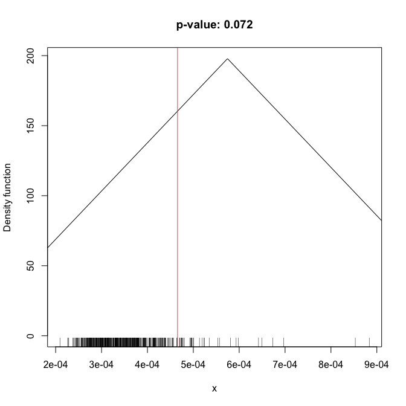
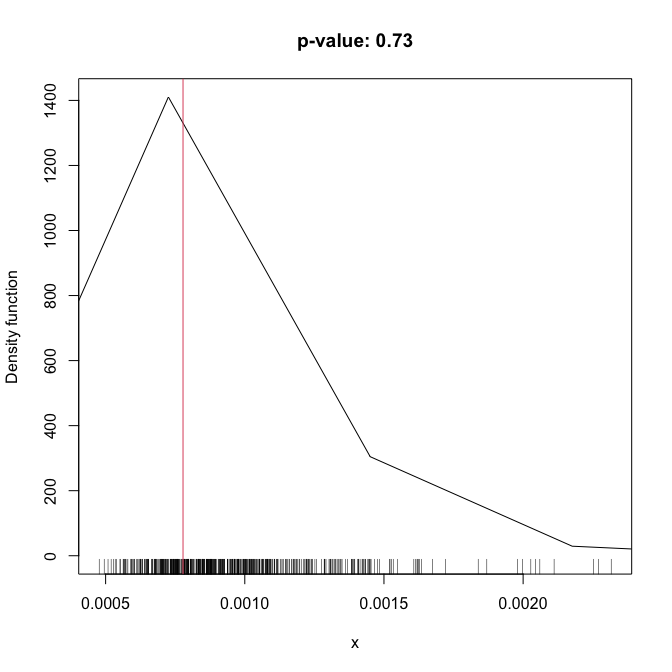
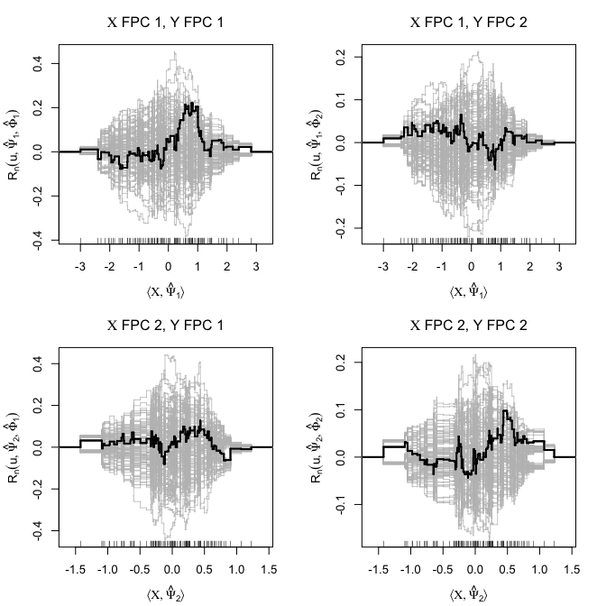
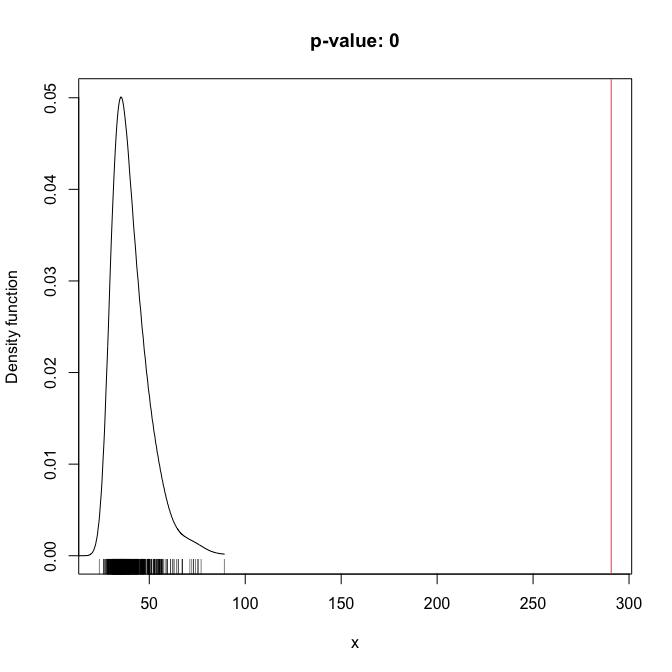

# goffda

[](https://www.gnu.org/licenses/gpl-3.0)
[](https://travis-ci.org/egarpor/goffda)
[](https://cran.r-project.org/package=goffda)
[](https://cran.r-project.org/package=goffda)
[](https://cran.r-project.org/package=goffda)

<!--  -->

## Overview

Software companion for the paper “*A goodness-of-fit test for the
functional linear model with functional response*” (García-Portugués,
Álvarez-Liébana, Álvarez-Pérez and González-Manteiga, 2021). It
implements the proposed estimators and goodness-of-fit tests for the
functional linear model with scalar response. It also allows to
replicate the data application presented.

## Installation

Get the released version from CRAN:

``` r
# Install the package
install.packages("goffda")

# Load package
library(goffda)
```

Alternatively, get the latest version from GitHub:

``` r
# Install the package
library(devtools)
install_github("egarpor/goffda")

# Load package
library(goffda)
```

## Usage

The following are some simple examples of the usage of the main function
of the package, `flm_test`. More examples are available in `?flm_test`.

``` r
# Generate data under H0
n <- 100
set.seed(987654321)
X_fdata <- r_ou(n = n, t = seq(0, 1, l = 101), sigma = 2)
epsilon <- r_ou(n = n, t = seq(0, 1, l = 101), sigma = 0.5)
Y_fdata <- epsilon

# Test the FLMFR
flm_test(X = X_fdata, Y = Y_fdata, verbose = FALSE)
```



    #> 
    #>  Goodness-of-fit test for the functional linear model (functional
    #>  predictor and functional response)
    #> 
    #> data:  Y_fdata ~ X_fdata
    #> statistic = 0.0004656, p = 17, q = 20, p-value = 0.072

    # Simple hypothesis
    flm_test(X = X_fdata, Y = Y_fdata, beta0 = 0, verbose = FALSE)



    #> 
    #>  Goodness-of-fit test for the functional linear model (functional
    #>  predictor and functional response; simple hypothesis)
    #> 
    #> data:  Y_fdata ~ X_fdata
    #> statistic = 0.00077811, p = 17, q = 20, p-value = 0.73

    # Generate data under H1
    n <- 100
    set.seed(987654321)
    sample_frm_fr <- r_frm_fr(n = n, scenario = 3, s = seq(0, 1, l = 101),
                              t = seq(0, 1, l = 101), nonlinear = "quadratic")
    X_fdata <- sample_frm_fr[["X_fdata"]]
    Y_fdata <- sample_frm_fr[["Y_fdata"]]

    # Test the FLMFR
    flm_test(X = X_fdata, Y = Y_fdata, verbose = FALSE)



    #> 
    #>  Goodness-of-fit test for the functional linear model (functional
    #>  predictor and functional response)
    #> 
    #> data:  Y_fdata ~ X_fdata
    #> statistic = 290.71, p = 4, q = 7, p-value < 2.2e-16

## AEMET temperatures data

An illustration of the test application in a real dataset.

``` r
## Data preprocessing

# Load raw data
data("aemet_temp")

# Partition the dataset
with(aemet_temp, {
  ind_pred <- which((1974 <= df$year) & (df$year <= 1993))
  ind_resp <- which((1994 <= df$year) & (df$year <= 2013))
  aemet_temp_pred <<- list("df" = df[ind_pred, ], "temp" = temp[ind_pred])
  aemet_temp_resp <<- list("df" = df[ind_resp, ], "temp" = temp[ind_resp])
})

# Average the temperature on each period
mean_aemet <- function(x) {
  m <- tapply(X = 1:nrow(x$temp$data), INDEX = x$df$ind,
              FUN = function(i) colMeans(x$temp$data[i, , drop = FALSE],
                                         na.rm = TRUE))
 x$temp$data <- do.call(rbind, m)
 return(x$temp)
}

# Build predictor and response fdatas
aemet_temp_pred <- mean_aemet(aemet_temp_pred)
aemet_temp_resp <- mean_aemet(aemet_temp_resp)

# Average yearly temperatures
avg_year_pred <- rowMeans(aemet_temp_pred$data)
avg_year_resp <- rowMeans(aemet_temp_resp$data)

# Average temperatures on both periods
plot(func_mean(aemet_temp_pred), ylim = c(5, 30),
     main = "Average AEMET temperature")
plot(func_mean(aemet_temp_resp), col = 2, add = TRUE)
legend("topleft", legend = c("1974-1993", "1994-2013"), col = 1:2, lwd = 2)
```


``` r
# Test composite and simple hypothesis
(gof <- flm_test(X = aemet_temp_pred, Y = aemet_temp_resp, B = 1e4,
                 verbose = FALSE, plot_dens = FALSE, plot_proc = FALSE))
#> 
#>  Goodness-of-fit test for the functional linear model (functional
#>  predictor and functional response)
#> 
#> data:  aemet_temp_resp ~ aemet_temp_pred
#> statistic = 186.79, p = 4, q = 3, p-value = 0.2582
beta0 <- diag(x = rep(1, length(aemet_temp_pred$argvals)))
flm_test(X = aemet_temp_pred, Y = aemet_temp_resp, verbose = FALSE,
         beta0 = beta0, B = 1e4, plot_dens = FALSE, plot_proc = FALSE)
#> 
#>  Goodness-of-fit test for the functional linear model (functional
#>  predictor and functional response; simple hypothesis)
#> 
#> data:  aemet_temp_resp ~ aemet_temp_pred
#> statistic = 2862.6, p = 4, q = 3, p-value = 1e-04

# Visualize estimation
lev <- seq(-0.022, 0.022, by = 0.004)
col <- colorRampPalette(colors = c("blue", "white", "red"))
filled.contour(x = aemet_temp_pred$argvals, y = aemet_temp_resp$argvals,
               z = gof$fit_flm$Beta_hat, levels = lev, color.palette = col)
```


## References

García-Portugués, E., Álvarez-Liébana, J., Álvarez-Pérez, G. and
González-Manteiga, W. (2021). A goodness-of-fit test for the functional
linear model with functional response. *Scandinavian Journal of
Statistics*, 48(2):502–528. <https://doi.org/10.1111/sjos.12486>

Cuesta-Albertos, J. A., García-Portugués, E., Febrero-Bande, M. and
González-Manteiga, W. (2019). Goodness-of-fit tests for the functional
linear model based on randomly projected empirical processes. *The
Annals of Statistics*, 47(1):439-467.
<https://doi.org/10.1214/18-AOS1693>

Febrero-Bande, M. and Oviedo de la Fuente, M. (2012). Statistical
Computing in Functional Data Analysis: The R Package fda.usc. *Journal
of Statistical Software*, 51(4):1-28.
<https://www.jstatsoft.org/v51/i04/>

García-Portugués, E., González-Manteiga, W. and Febrero-Bande, M.
(2014). A goodness-of-fit test for the functional linear model with
scalar response. *Journal of Computational and Graphical Statistics*,
23(3):761-778. <https://doi.org/10.1080/10618600.2013.812519>
